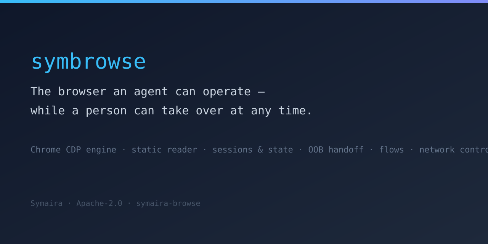

# Symaira Browse

[](https://github.com/danieljustus/symaira-browse/actions/workflows/ci.yml)
[](https://github.com/danieljustus/symaira-browse/releases/latest)
[](https://github.com/danieljustus/symaira-browse/actions/workflows/ci.yml)
[](LICENSE)
[](https://go.dev/)



> The browser an agent can operate while a person can take over at any time — without losing the session.

**Status:** pre-1.0 — the command surface is stabilizing under [SemVer](https://semver.org/); see [CHANGELOG.md](CHANGELOG.md) for the release history.

## Why symbrowse

- **Agent-operable Chrome sessions** — a real Chrome instance driven over the DevTools Protocol, with durable sessions instead of one-shot page fetches. If JavaScript, redirects, cookies, or interaction are needed, this is the tool.
- **Plain-HTTP fetch through MCP** — the absorbed `symfetch` static engine exposes `fetch_url`, `fetch_batch` and `wayback_snapshots` as MCP tools; CLI users use `read` and `batch` without a browser session.
- **Stable element references** — deterministic `@ref`s across navigation and re-renders, so an agent's plan doesn't break when the DOM reflows.
- **Out-of-band handoff** — hand control to a human for 2FA, CAPTCHA, or approval mid-session, then resume agent control without losing state.
- **Standalone-first** — runs on its own with no compile-time dependency on other Symaira tools; integrations are optional, runtime-only fallbacks.
- **Consumable form automation** — the public `formflow` package exposes typed, evidence-capturing web-form automation (navigate → fill → submit, CAPTCHA/bot-wall detection, confirmation links, per-host pacing) as an in-process Go API; see [docs/form-automation-contract.md](docs/form-automation-contract.md).

## Install

**Homebrew:**

```sh
brew tap danieljustus/tap
brew install symbrowse
```

**Go:**

```sh
go install github.com/danieljustus/symaira-browse/cmd/symbrowse@latest
```

**From source** (requires Go 1.26.5, POSIX shell, GNU Make; CGO-free):

```sh
make build
./symbrowse version
```

## Quick start

```sh
./symbrowse open "https://example.com" --session research
./symbrowse snapshot --session research
./symbrowse read --engine-hint --session research
```

`open` loads the page in a real Chrome, `snapshot` renders the interactive
tree with stable `@ref`s, and `read` returns the page as markdown in the
SymFetch output schema. Without Chrome, use the JS-free static engine:
`./symbrowse daemon --session <name> --engine static`.

### Example session

```text
$ ./symbrowse open "https://example.com" --session research
map[action:open http_status:200 url:https://example.com/]

$ ./symbrowse snapshot --session research
snap-1 tree:
  - document "Example Domain" [ref=e5]
    - heading "Example Domain" [ref=e2]
    - paragraph [ref=e1]
      - statictext "This domain is for use in documentation examples without needing permission. Avoid use in operations." [ref=e12]
    - paragraph [ref=e10]
      - link "Learn more" [ref=e6]
        - statictext "Learn more" [ref=e5]

$ ./symbrowse read "https://example.com" --session research --engine-hint
---
title: Example Domain
url: https://example.com
fetched_at: "2026-08-27T09:28:27Z"
lang: en
tokens_est: 139
---

# Example Domain

This domain is for use in documentation examples without needing permission.

[Learn more](https://iana.org/domains/example)
```

The `snapshot` output above is abbreviated; the real output carries stable
`@ref` keys for every node so later commands can address elements across
navigation and re-renders.

## Usage

`symbrowse` has two modes in one binary:

- **Static fetch** — the MCP tools `fetch_url` / `fetch_batch` /
  `wayback_snapshots` use the absorbed `symfetch` pipeline. On the CLI, use
  `read` for a page and `batch` for multiple commands; no browser is needed.
- **Interactive agent browser** — `open`, `snapshot`, `click`, `fill`,
  `type`, `press`, `wait`, `find`, `get`, `back`/`forward`/`reload` drive a
  real Chrome session with stable refs, cookies/storage state,
  out-of-band handoff, journal, flows, and network control.

```text
$ ./symbrowse version
symbrowse v0.5.0

$ ./symbrowse --help
symbrowse is the standalone command-line entrypoint for Symaira Browse.

Usage:
  symbrowse [command]

Core Commands:
  batch          Run multiple commands in one process and report per-item status
  check          Check a checkbox or radio element
  click          Click an element matching a selector or @ref
  dblclick       Double-click an element matching a selector or @ref
  fill           Fill an input element, replacing its content
  find           Find an element semantically and optionally act on it
  focus          Focus an element matching a selector or @ref
  get            Inspect page and element values
  goto           Navigate to a URL (alias for open)
  hover          Hover over an element matching a selector or @ref
  is             Check page and element state
  open           Open a URL in the browser and wait for load
  press          Press a keyboard key on an element
  read           Render the page as markdown (or JSON) in the symfetch output schema
  screenshot     Capture the page (viewport, --full page, or --selector element)
  scroll         Scroll the page or an element by pixel amount
  scrollintoview Scroll an element into the visible viewport
  select         Select an option from a drop-down element
  snapshot       Render the accessibility tree
  type           Type text into an element, appending to its content
  uncheck        Uncheck a checkbox element
  wait           Wait for a browser condition

Navigation Commands:
  back           Navigate back in page history
  dialog         Handle JavaScript dialogs (accept, dismiss, status, auto)
  forward        Navigate forward in page history
  frame          Address nested frames (tree, select, main)
  reload         Reload the current page
  tab            Manage session tabs (list, new, switch, close)

State Commands:
  auth           Credential management through symvault (no plaintext)
  cookies        Inspect and manage cookies of the current page origin
  handoff        Hand the session over to the human without losing it (2FA, CAPTCHA, approval)
  journal        Inspect the append-only action journal
  oob            Inspect the out-of-band human channel
  profiles       List discovered Chrome profiles available for reuse
  session        Inspect browser sessions
  set            Apply session-wide emulation settings (viewport, device, geo, offline, headers, media, user-agent)
  state          Save, restore and manage named browser session states
  storage        Inspect and manage per-origin web storage
  watch          Watch an agent session: stream the action journal live (read-only)

Network Commands:
  downloads      Show download events (origin URL, size, checksum) or set the download directory
  network        Inspect, mock and export page network activity (issue #59)
  upload         Upload files into a file input (path-guarded, issue #63)

Debug Commands:
  a11y           Run an axe-core accessibility audit on the current page
  cache          Inspect the truncate-and-store output cache
  config         Inspect symbrowse configuration
  console        Show or clear the page console buffer
  daemon         Run or inspect the symbrowse daemon
  diff           Compare snapshots, screenshots and URLs
  doctor         Check browser discovery and local runtime prerequisites
  errors         Show or clear uncaught page errors
  eval           Execute JavaScript in the active page (issue #60)
  mcp            Start the MCP stdio server (JSON-RPC 2.0 over stdin/stdout)
  policy         Inspect the local risk policy
  trace          Export and replay repeatable action traces
  upgrade        Check for and apply symbrowse updates
  version        Print the symbrowse version

Flows Commands:
  flow           Validate, run and record declarative browser flows

Additional Commands:
  completion     Generate the autocompletion script for the specified shell
  help           Help about any command

Flags:
  -h, --help            help for symbrowse
      --json            print the unified machine-readable output envelope (shorthand for --output json)
      --output string   output format: text, json or yaml (--json is shorthand for --output json) (default "text")
  -v, --version         version for symbrowse

Use "symbrowse [command] --help" for more information about a command.
```

## MCP / Agent integration

`symbrowse mcp` runs a JSON-RPC-2.0 MCP server over stdio. Tools proxy to the
local daemon; every session is isolated; the domain allowlist and the SSRF
guard apply in MCP mode. The three SymFetch contracts are exposed as
first-class tools, so clients can switch from the retired `symfetch` runtime
without losing fast fetch, batch fetch, or Wayback discovery.

```sh
symbrowse mcp                 # default profile (core), SSRF guard on
symbrowse mcp --tools all     # full tool surface
symbrowse mcp --allow-private # allow private/loopback targets explicitly
```

See [docs/mcp.md](docs/mcp.md) for setup, tool profiles, the SymFetch
migration, and the Hermes config switch.

## Configuration

Configuration follows XDG conventions with a `SYMBROWSE_` environment prefix
and a `config.toml` (via `configkit`). Key settings: domain allowlist,
SSRF guard, cache TTL and directory, state retention, autosave policy, and
Chrome executable override. See [docs/state.md](docs/state.md) for state
encryption and [docs/allowlist.md](docs/allowlist.md) for the network policy.

## Documentation

- [docs/tiers.md](docs/tiers.md) — escalation tiers and `read --engine-hint`
- [docs/mcp.md](docs/mcp.md) — MCP server setup, tool profiles, SymFetch migration
- [docs/errors.md](docs/errors.md) — stable error schema
- [docs/output-schema.md](docs/output-schema.md) — read/output schema
- [docs/benchmarks.md](docs/benchmarks.md) — benchmark results
- [docs/ssrf.md](docs/ssrf.md) — SSRF guard (private/loopback targets; MCP default deny, `--allow-private`)
- [docs/injection.md](docs/injection.md) — prompt-injection scan
- [docs/allowlist.md](docs/allowlist.md) — domain allowlist network policy
- [docs/state.md](docs/state.md) — state encryption and retention

## Ecosystem

Symaira Browse is part of the [Symaira](https://symaira.com) product family:
it is the browser/agent-navigation core, complementing the Markdown-vault
workspace (`symdesk`), the credential vault (`symvault`), and the FRITZ!Box
controller (`symfritz`). It talks to the shared `corekit` render pipeline
(`domkit`) and follows the same CGO-free, zero-stdio-pollution conventions
as its siblings.

## Development

See [CONTRIBUTING.md](CONTRIBUTING.md) for the full contribution workflow.
The short version: build and verify before opening a pull request.

```sh
make fmt-check
make build
make test
make lint
```

Changes to the default branch are squash-merged only.

## Contributing · Security · License

- [CONTRIBUTING.md](CONTRIBUTING.md) — contribution workflow
- [SECURITY.md](SECURITY.md) — security reporting policy
- [AGENTS.md](AGENTS.md) — repository rules for contributors and agents

Licensed under the Apache-2.0 license. See [LICENSE](LICENSE).
