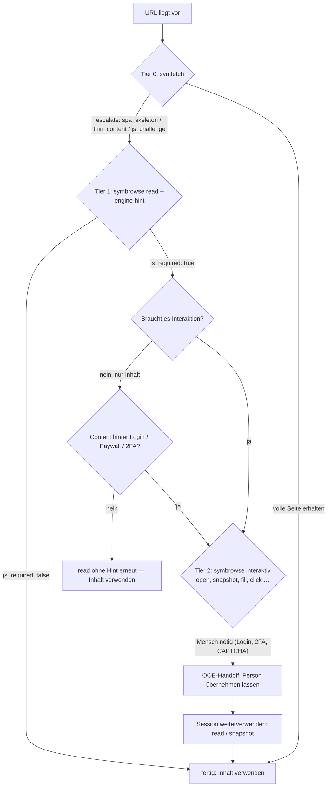

# Der Eskalationsvertrag mit `symfetch` (Tiers)

Ein Agent soll nicht raten müssen, welches Werkzeug er für eine URL
braucht. Der Vertrag (Issue #35) macht die Wahl
beobachtbar:

- **`symfetch`** erkennt SPA-Skeletons und dünnen Inhalt und ergänzt dann
  `{"escalate": {"tool": "symbrowse", "reason": …, "command": "symbrowse read <url>"}}`
  (Gegenstück X-1 im `symaira-fetch`-Repo).
- **`symbrowse read <url>`** liefert dasselbe Ausgabeschema wie `symfetch`
  (YAML-Frontmatter `title`, `url`, `fetched_at`, `lang`, `schema_type`;
  Markdown-Körper; dieselben JSON-Feldnamen; dieselbe
  Truncate-and-store-Semantik).
- **`symbrowse read --engine-hint`** meldet zusätzlich, ob JavaScript für
  den Inhalt tatsächlich nötig war:

```json
{
  "success": true,
  "data": {
    "url": "https://example.com/spa",
    "title": "Delayed hydration SPA",
    "markdown": "…",
    "js_required": true,
    "js_required_reason": "page content differs when JavaScript is disabled (a static fetch would miss content)"
  }
}
```

`js_required: false` heißt: Eine statische Abholung (Tier 0) hätte denselben
Inhalt geliefert — der Agent kann beim nächsten Mal direkt `symfetch`
nehmen. `js_required: true` heißt: Ohne Browser geht Inhalt verloren.

## Entscheidungsbaum für Agenten



Kurzfassung:

| Situation | Werkzeug |
|---|---|
| Statische Seite, keine Interaktion nötig | `symfetch` (Tier 0) |
| `escalate`-Hinweis oder unsicher, ob JS nötig | `symbrowse read --engine-hint` (Tier 1) |
| `js_required: true`, nur Inhalt | `symbrowse read` (Inhalt ist ohnehin gerendert) |
| Interaktion nötig (Formular, Klicks, Login) | `symbrowse` interaktiv (Tier 2) |
| Login/2FA/CAPTCHA | Mensch per OOB-Kanal, dann Session weiterverwenden |

## Semantik von `js_required`

Die Entscheidung fällt durch einen Seitenvergleich: `read --engine-hint`
lädt die URL ein zweites Mal in einer Probe-Seite mit deaktiviertem
JavaScript (`Emulation.setScriptExecutionDisabled`) und vergleicht den
sichtbaren Text (`<body>`) mit der gerenderten Seite.

- Identischer Text → `false` (statischer Inhalt; Markup-Unterschiede wie
  Hydration-Attribute zählen nicht).
- Unterschiedlicher Text → `true` mit Begründung (eine statische Abholung
  hätte Inhalt verpasst).

Die Proben-Last ist eine zusätzliche Navigation derselben Session; sie
ändert die aktuelle Seite nicht. Die Vergleichs-Heuristik ist absichtlich
konservativ: Seiten, die nur per JS Zusatzinhalte nachladen (Infinite
Scroll), werden als `js_required: true` gemeldet, auch wenn der
Kerninhalt statisch wäre.
