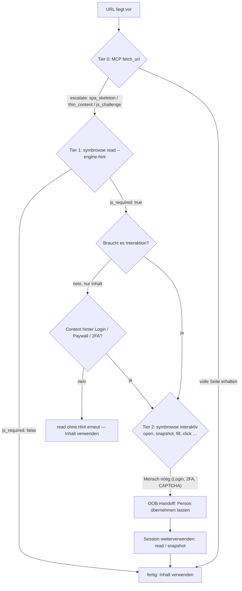

# Der Eskalationsvertrag mit der statischen Fetch-Pipeline (Tiers)

Ein Agent soll nicht raten müssen, welches Werkzeug er für eine URL
braucht. Der Vertrag (Issue #35) macht die Wahl
beobachtbar:

- **Die statische Fetch-Pipeline (Tier 0)** ist über die MCP-Tools
  `fetch_url`, `fetch_batch` und `wayback_snapshots` erreichbar. Sie erkennt
  SPA-Skeletons und dünnen Inhalt und ergänzt dann eine
  Eskalations-Empfehlung:

```json
{
  "escalate": {
    "tool": "symbrowse",
    "mcp_tool": "read",
    "reason": "spa_skeleton",
    "command": "symbrowse read https://example.com/spa"
  }
}
```

  `command` ist der CLI-Aufruf, `mcp_tool` der Toolname für MCP-Clients —
  beide benennen dieselbe Eskalation, ein Client nimmt die Variante seiner
  Oberfläche. `reason` ist `spa_skeleton` oder `thin_content`.

  Wo der Hinweis auftaucht: bei `format: json` als Feld des Dokuments, bei
  `format: markdown` und `format: text` als Geschwisterfeld der Antwort und
  zusätzlich im Metadaten-Kopf des gerenderten Markdowns. Seiten, die eine
  statische Abholung vollständig geliefert hat, tragen kein `escalate`.
- **`symbrowse read <url>`** liefert dasselbe Ausgabeschema wie `symfetch`
  (YAML-Frontmatter `title`, `url`, `fetched_at`, `lang`, `schema_type`;
  Markdown-Körper; dieselben JSON-Feldnamen; dieselbe
  Truncate-and-store-Semantik).
- **`symbrowse read --engine-hint`** meldet zusätzlich, ob JavaScript für
  den Inhalt tatsächlich nötig war:

```json
{
  "success": true,
  "data": {
    "url": "https://example.com/spa",
    "title": "Delayed hydration SPA",
    "markdown": "…",
    "js_required": true,
    "js_required_reason": "page content differs when JavaScript is disabled (a static fetch would miss content)"
  }
}
```

`js_required: false` heißt: Eine statische Abholung (Tier 0) hätte denselben
Inhalt geliefert — ein MCP-Agent kann beim nächsten Mal direkt `fetch_url`
nehmen. `js_required: true` heißt: Ohne Browser geht Inhalt verloren.

## Entscheidungsbaum für Agenten



Kurzfassung:

| Situation | Werkzeug |
|---|---|
| Statische Seite, keine Interaktion nötig | MCP `fetch_url` (Tier 0) |
| `escalate`-Hinweis oder unsicher, ob JS nötig | `symbrowse read --engine-hint` (Tier 1) |
| `js_required: true`, nur Inhalt | `symbrowse read` (Inhalt ist ohnehin gerendert) |
| Interaktion nötig (Formular, Klicks, Login) | `symbrowse` interaktiv (Tier 2) |
| Login/2FA/CAPTCHA | Mensch per OOB-Kanal, dann Session weiterverwenden |

Die CLI bietet keinen separaten `fetch`-Befehl. `symbrowse read` läuft mit dem
Standard-Daemon browserbasiert; ein explizit mit `--engine static` gestarteter
Daemon ermöglicht dort einen browserlosen CLI-Read, ist aber nicht die
`fetch_url`-MCP-Schnittstelle.

## Semantik von `js_required`

Die Entscheidung fällt durch einen Seitenvergleich: `read --engine-hint`
lädt die URL ein zweites Mal in einer Probe-Seite mit deaktiviertem
JavaScript (`Emulation.setScriptExecutionDisabled`) und vergleicht den
sichtbaren Text (`<body>`) mit der gerenderten Seite.

- Identischer Text → `false` (statischer Inhalt; Markup-Unterschiede wie
  Hydration-Attribute zählen nicht).
- Unterschiedlicher Text → `true` mit Begründung (eine statische Abholung
  hätte Inhalt verpasst).

Die Proben-Last ist eine zusätzliche Navigation derselben Session; sie
ändert die aktuelle Seite nicht. Die Vergleichs-Heuristik ist absichtlich
konservativ: Seiten, die nur per JS Zusatzinhalte nachladen (Infinite
Scroll), werden als `js_required: true` gemeldet, auch wenn der
Kerninhalt statisch wäre.
